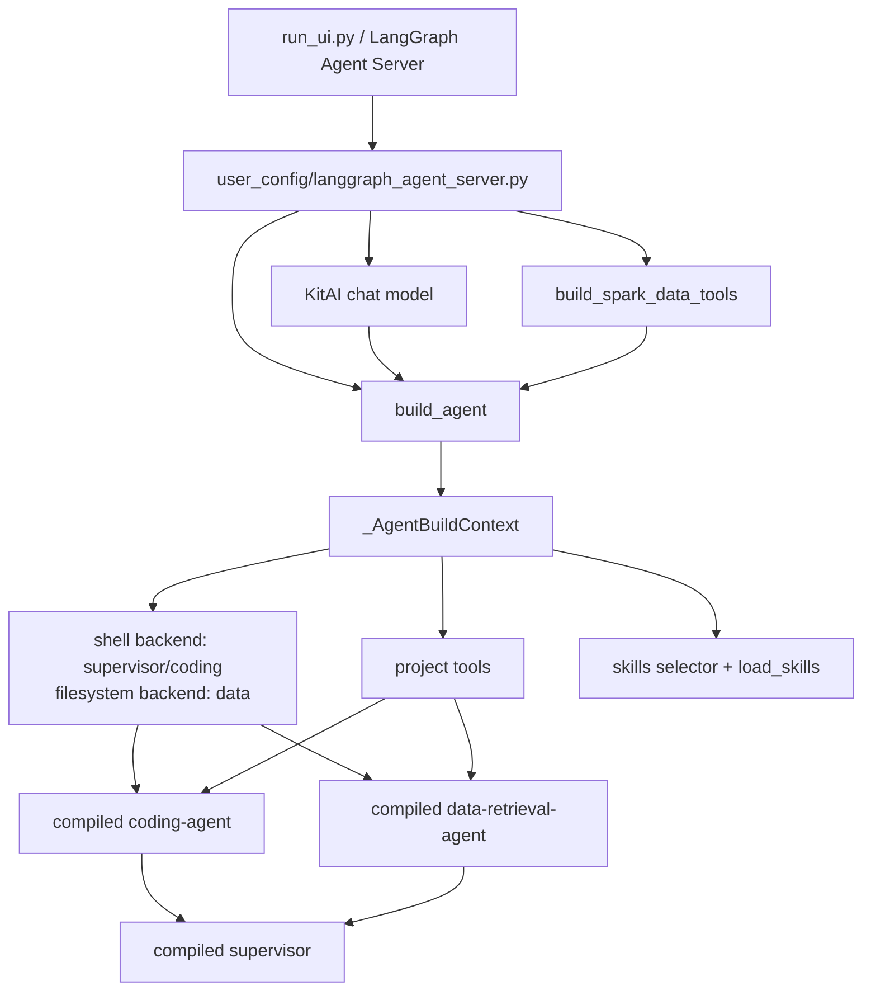
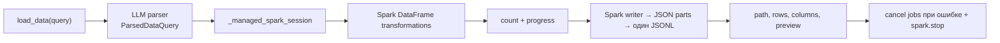

# Архитектура DeepAgent

## Сборка

`_register_deepagents_profile()` отключает базовый prompt и автоматический
`general-purpose` subagent внешней библиотеки. В graph остаются только явно
собранные `coding-agent` и `data-retrieval-agent`.

## Роли и доступ

| Роль | Project tools | Backend |
| --- | --- | --- |
| Supervisor | `load_skills`, `python`, `get_project_structure`, внешние `supervisor_tools` | `Utf8LocalShellBackend` |
| coding-agent | `load_skills`, `python`, `get_project_structure`, `convert_jupyter_notebook`, `review_refactor` | `Utf8LocalShellBackend` |
| data-retrieval-agent | `data_tools`, `load_skills`, `python` | `Utf8FilesystemBackend` |

`edit_file` скрыт от всех трёх ролей только на уровне prompt. Это не security
boundary. Data-agent не имеет рабочего shell backend, но filesystem tools остаются.

## Skills

Supervisor строит компактный index всех `SKILL.md`, отдельным structured-output
вызовом выбирает релевантные файлы и полностью добавляет их в system message.
Data-agent читает тот же выбор через общий `shared_selection`. Coding-agent при
необходимости вызывает `load_skills` сам. Нативный каталог skills DeepAgents не
подключён, чтобы один и тот же список не попадал в prompt вторым способом.

## Spark

Текущая SQL-like/LLM/Spark execution-логика сохранена. HITL удалён: запрос не
останавливается на approval. Полный результат сохраняет сам `load_data`; отдельного
PKL-offload middleware больше нет.

## Memory и persistence

Все роли читают `AGENTS.md` через `MemoryMiddleware`. Если data-tool содержит
`spark_session_factory` в metadata, supervisor дополнительно создаёт и читает
`/.deep_agent/memory/user_profile.md`.

При прямом вызове `build_agent` используется `InMemorySaver`. UI adapter передаёт
`checkpointer=None`, потому что persistence threads предоставляет Agent Server.
Локальный runtime `langgraph dev` периодически сохраняет threads, runs, store и checkpoints
в `<cwd>/.langgraph_api/*.pckl`, а при следующем запуске загружает их обратно. Launcher задаёт
`cwd` равным корню проекта, поэтому история UI переживает полный перезапуск приложения.

## Артефакты

- `artifacts/*.jsonl` — полный результат Spark `load_data`;
- `.deep_agent/memory/` — профиль пользователя;
- `.deep_agent/review_snapshots/` — исходные версии файлов для review;
- `.deep_agent/notebook_scripts/` — служебные notebook scripts;
- `debug_prompts/*.json` — фактические model requests.
