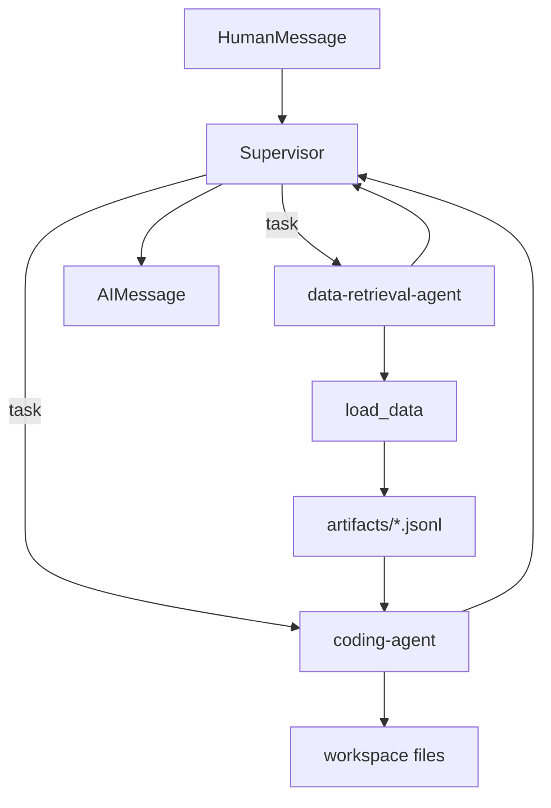

# Структура graph, state и данных

## Graph



Автоматического `general-purpose` subagent нет. Review-agent создаётся лениво внутри
`review_refactor` и не является отдельной ролью supervisor.

## State

`AnalyticsAgentState` расширяет штатный `AgentState` приватными полями skills:

- признак загрузки context;
- ключ последнего пользовательского запроса;
- выбранные пути skills;
- полный выбранный context;
- статус, причина, ошибки validation и retry selector-а;
- пути skills, которые затем материализовал `load_skills`.

Отдельные middleware добавляют свои state schemas: request logger хранит ключ уже
записанного turn, todo middleware — служебный ключ последнего user turn.

## Передача tools

`_AgentTools` содержит один экземпляр каждого project tool. `PythonTool` и его
`DeepAgentPythonSandbox` общие для трёх ролей, поэтому globals Python сохраняются между
их вызовами в пределах одного graph. Role builders передают каждому агенту только его
список tools.

## Передача SparkSession

В graph хранится не готовая session, а `spark_session_factory` в metadata исходного
data-tool. Сам tool замыкает factory и создаёт session на каждый вызов. Та же factory
используется middleware профиля пользователя.

```text
factory
  -> load_data: managed session -> parser -> transformations -> JSONL -> stop
  -> user profile: session -> addressbook query -> memory file -> stop
```

## Результат load_data

```text
ReadTableInput.query
  -> ParsedDataQuery
  -> Spark DataFrame
  -> count
  -> artifacts/load_data_<source>_<hash>.jsonl
  -> content_and_artifact:
       workspace_file
       absolute_file
       rows
       columns
       preview_rows
       original_query
       query_language
```

HITL и дополнительный PKL-offload отсутствуют. Для дальнейших расчётов агент читает
готовый JSONL через `python`, не запускает повторный `load_data`.

## Пути

Для model-facing filesystem tools корень workspace всегда выглядит как `/`.
`workspace_tool_path()` переводит реальный путь в виртуальный, а
`FilesystemPathContractMiddleware` нормализует входные аргументы и не допускает выход
filesystem tool за workspace. Python tool не является security sandbox.

## Настройки, которые реально используются

- workspace, skills и artifacts paths;
- shell timeout и max output bytes;
- context editing threshold и число сохраняемых tool results;
- default limit `read_file`;
- model retries;
- общий tool-call limit;
- model-call limit subagents.

Неиспользуемые `thread_id`, `graph_recursion_limit`, trace settings и параметры
PKL-offload удалены.
