# Карта middleware

Здесь зафиксирован фактический stack после cleanup. Источник истины —
`deep_agent/agent.py` и `deep_agent/agent_graph_builder.py`.

## Общий runtime stack проекта

```mermaid
flowchart LR
    A["DiagnosticLogging"] --> B["PromptToolFilter<br/>если есть скрытые имена"]
    B --> C["PromptToolDescriptions"]
    C --> D["FilesystemPathContract"]
    D --> E["ShellSafety"]
    E --> F["LoopBreaker"]
    F --> G["ModelRetry"]
    G --> H["ContextEditing"]
    H --> I["ToolCallLimit"]
    I --> J["ToolContextNotice"]
    J --> K["ModelCallLimit<br/>только subagents"]
    K --> L["MemoryMiddleware"]
    L --> M["PromptLogging"]
```

`ThinkToolMiddleware` и `ToolOutputFileMiddleware` удалены. Первый не выполнял
никакой работы, второй не обрабатывал текущий file artifact `load_data`.

## Различия ролей

| Роль | Middleware перед общим stack | Скрытые tools | Дополнение |
| --- | --- | --- | --- |
| Supervisor | `TodoReset`, опциональные `AgentRequestLogging` и `UserProfileMemory`, `PreloadedSkillsContext` | `edit_file` | Skills selector выбирает и загружает полный текст релевантных skills. |
| coding-agent | нет | `edit_file` | Имеет `ModelCallLimit`; дополнительные skills загружает через `load_skills`. |
| data-retrieval-agent | `PreloadedSkillsContext` в режиме чтения общего выбора | `edit_file` | Получает тот же skill context, который выбрал supervisor. |
| review-refactor-agent | нет | filesystem write, shell, todo и task | Использует prompt filter, prompt logging и deny-permission на запись. |

## Что добавляет DeepAgents

Внешний `create_deep_agent` добавляет штатные todo, filesystem, summarization,
patch-tool-calls и, когда переданы compiled subagents, tool `task`. Нативный
`SkillsMiddleware` не подключается: проект использует собственный selector и
`load_skills`. Автоматический `general-purpose` subagent отключён через
`HarnessProfile`.

HITL отсутствует: проект не передаёт `interrupt_on`, не использует permission
`mode="interrupt"` и не вызывает `interrupt()` из Spark tool.

## Зачем нужен каждый project middleware

| Middleware | Реальная функция |
| --- | --- |
| `TodoResetMiddleware` | Очищает todo между пользовательскими turn и после финального ответа. |
| `AgentRequestLoggingMiddleware` | Один раз пишет новый human-запрос в PostgreSQL. |
| `UserProfileMemoryMiddleware` | До чтения memory создаёт профиль пользователя через Spark. |
| `PreloadedSkillsContextMiddleware` | Выбирает релевантные `SKILL.md` и добавляет их текст в prompt. |
| `DiagnosticLoggingMiddleware` | Пишет start/success/error model call в stdout. |
| `PromptToolFilterMiddleware` | Скрывает tool только из model-visible metadata. |
| `PromptToolDescriptionsMiddleware` | Подменяет descriptions tools. |
| `FilesystemPathContractMiddleware` | Нормализует workspace paths и добавляет preview записи. |
| `ShellSafetyMiddleware` | Блокирует известные небезопасные формы `execute`. |
| `LoopBreakerMiddleware` | Добавляет подсказку сменить стратегию при повторяющемся цикле. |
| `ModelRetryMiddleware` | Повторяет временные provider/network errors. |
| `ContextEditingMiddleware` | Удаляет старые tool results после token threshold. |
| `ToolCallLimitMiddleware` | Ограничивает число tool calls одного run. |
| `ToolContextNoticeMiddleware` | Добавляет пояснение к результату и recovery hint к ошибке. |
| `ModelCallLimitMiddleware` | Ограничивает model calls специализированного subagent. |
| `MemoryMiddleware` | Загружает `AGENTS.md`, у supervisor также user profile. |
| `PromptLoggingMiddleware` | Сохраняет итоговый `ModelRequest` в `debug_prompts`. |

Sync и async hooks middleware не считаются дублями: LangChain вызывает разные
варианты для синхронного и асинхронного graph runtime.
