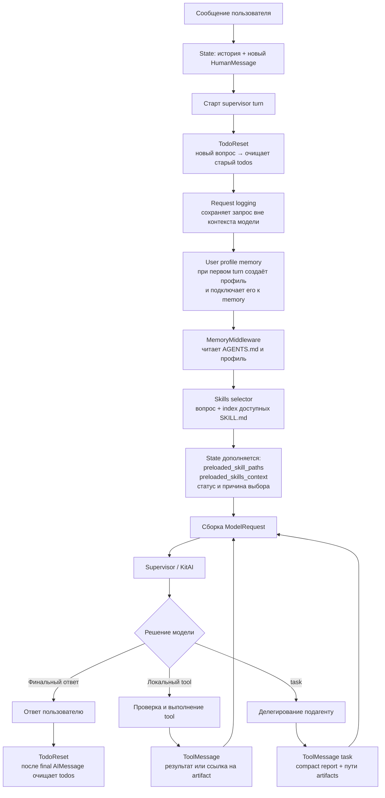
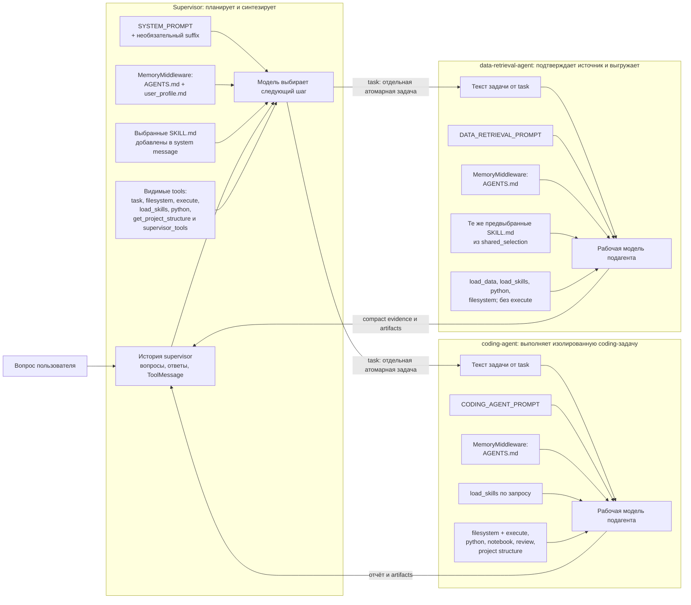
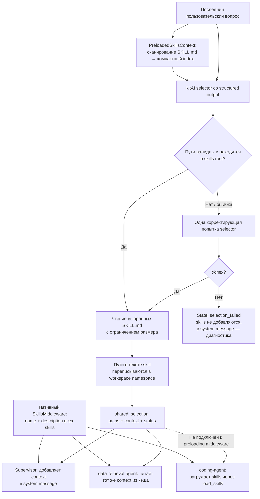
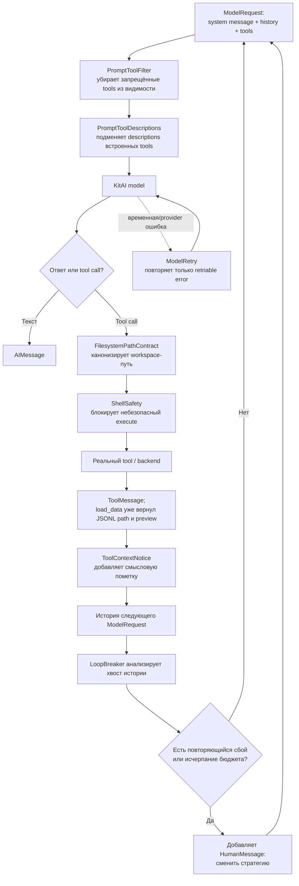
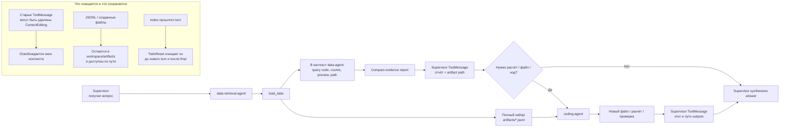

# Логическая жизнь запроса в DeepAgent

Документ описывает движение запроса, контекста и артефактов между ролями: полный путь запроса, видимость контекста ролями, выбор skills, tool-вызов и очистку контекста, а также передачу результата между агентами.

## 1. Полный путь запроса

Логгер не добавляет данные в prompt. Профиль пользователя не заменяет контекст: он создаёт memory-файл, который DeepAgents затем читает как системную память supervisor.

## 2. Что именно видит каждая роль

Подагенты не становятся копией supervisor: supervisor передаёт им формулировку атомарной задачи через task, а их рассуждение, tool history и лимиты остаются собственными. Общий канал для крупных результатов — файлы workspace/artifacts, а не полная история supervisor.

## 3. Как skills попадают в контекст

Каждая основная модель видит нативный index skills с `name` и `description`.
Дополнительно supervisor и data-agent получают полный текст автоматически
выбранных `SKILL.md`, но не всю папку skills. Связанные markdown-файлы и другие
skills любая роль может запросить через `load_skills`.

## 4. Жизнь одного model/tool шага

MemoryMiddleware добавляет файлы памяти в system prompt до model call. ToolCallLimit ограничивает число вызовов tools в запуске. У подагентов дополнительно действует ModelCallLimit. ContextEditing при достижении token-порога очищает старые tool-результаты из истории, но не удаляет созданные artifacts и не отменяет результат уже выполненного tool.

## 5. Передача данных между агентами и очистка контекста

Главный принцип: через prompt и ToolMessage передаются краткие доказательства и пути; через workspace/artifacts передаются полные наборы данных. Это предотвращает повторную выгрузку и не перегружает контекст модели.
