# Mermaid-диаграмма работы DeepAgent

Файл содержит архитектурную Mermaid-диаграмму работы аналитического DeepAgent:

- `build_analytics_deep_agent` - сборка supervisor-а, subagent-ов, tools, middleware и prompt-контекста.
- `supervisor` - главный агент, который выбирает контекст, делегирует задачи и формирует финальный ответ.
- `coding-agent` - subagent для кода, файлов, документации, notebook-ов и валидации.
- `data-retrieval-agent` - subagent для чтения табличных данных через `load_data`.
- `skills` - слой доменных `SKILL.md`, preloaded skills и дополнительной загрузки через `load_skills`.
- `prompts` - слой системных prompt-ов и runtime-подстановок.

## Общая схема

```mermaid
flowchart TB
    user["Пользовательский запрос"] --> invoke["agent.invoke / stream"]
    invoke --> builder["build_analytics_deep_agent"]

    subgraph build_layer["Слой сборки агента"]
        settings["settings\nconfig/defaults.json + args"]
        data_tools_factory["data_tools\nпереданы явно или через data_tools_factory"]
        data_wrapper["wrap_data_tools_with_query_code\nдобавляет query code, row count, artifact metadata"]
        backends["backends\nsupervisor: shell workspace\ncoding-agent: shell workspace\ndata-agent: filesystem only"]
        session_artifacts["session tool outputs\nruns/deep_agent_tool_outputs"]
        common_runtime["runtime context\ncurrent date, workspace, artifacts, skills path, AGENTS.md"]
        gigachat_practices["gigachat practices prompt"]
    end

    builder --> settings
    settings --> data_tools_factory --> data_wrapper
    settings --> backends
    settings --> session_artifacts
    builder --> common_runtime
    builder --> gigachat_practices

    subgraph skill_layer["Слой skills"]
        skills_root["/deep_agent/skills"]
        skills_index["Skills index\npath, name, description"]
        supervisor_skill_select["PreloadedSkillsContextMiddleware\nselect_skills=True"]
        shared_selection["shared_selection\nединый выбор skills для run"]
        subagent_skill_context["PreloadedSkillsContextMiddleware\nselect_skills=False"]
        load_skills["tool: load_skills\nдочитывает конкретные SKILL.md / fields.md / joins.md"]
    end

    skills_root --> skills_index
    skills_index --> supervisor_skill_select --> shared_selection --> subagent_skill_context
    skills_root --> load_skills

    subgraph prompt_layer["Слой prompt-подстановок"]
        user_prompt["Human message\nисходный запрос пользователя"]
        supervisor_prompt["SYSTEM_PROMPT\nроль, workflow, delegation, data principles"]
        supervisor_preloaded["SUPERVISOR_PRELOADED_SKILLS_CONTEXT_PROMPT_TEMPLATE\n{context}=выбранные SKILL.md"]
        data_prompt["DATA_RETRIEVAL_PROMPT\nправила чтения таблиц и отчета"]
        data_preloaded["DATA_RETRIEVAL_PRELOADED_SKILLS_CONTEXT_PROMPT_TEMPLATE\n{context}=shared selected skills"]
        coding_prompt["CODING_AGENT_PROMPT\nправила работы с кодом и файлами"]
        native_skills_prompt["DeepAgents native skills context\nskills=[/deep_agent/skills]"]
        suffix_prompt["system_prompt_suffix\nопциональная добавка вызывающего кода"]
        memory_prompt["memory=[AGENTS.md]\nпроектные правила"]
    end

    common_runtime --> supervisor_prompt
    gigachat_practices --> supervisor_prompt
    supervisor_skill_select --> supervisor_preloaded
    subagent_skill_context --> data_preloaded
    skills_root --> native_skills_prompt
    invoke --> user_prompt

    subgraph supervisor_layer["Supervisor"]
        supervisor_agent["supervisor compiled graph\ncreate_deep_agent"]
        supervisor_tools["tools supervisor-а\nload_skills, python, get_project_structure, extra_tools"]
        supervisor_builtin["встроенные DeepAgents tools\nwrite_todos, task, filesystem, execute"]
        supervisor_mw["middleware\nTodoReset, skill context, tool descriptions, think,\nshell safety, loop breaker, retries, path contract,\noffload, context editing, tool limits, notice, logging"]
    end

    supervisor_prompt --> supervisor_agent
    supervisor_preloaded --> supervisor_agent
    native_skills_prompt --> supervisor_agent
    suffix_prompt --> supervisor_agent
    memory_prompt --> supervisor_agent
    user_prompt --> supervisor_agent
    supervisor_tools --> supervisor_agent
    supervisor_builtin --> supervisor_agent
    supervisor_mw --> supervisor_agent

    subgraph delegation_layer["Слой делегирования через task"]
        task_tool["tool: task\nвыбор subagent-а и bounded objective"]
        subagent_registry["build_subagent_specs\ncoding-agent + data-retrieval-agent"]
    end

    supervisor_agent --> task_tool --> subagent_registry

    subgraph coding_layer["coding-agent"]
        coding_agent["compiled coding-agent\ncreate_deep_agent"]
        coding_tools["tools\nload_skills, python, get_project_structure,\nconvert_jupyter_notebook"]
        coding_builtin["встроенные workspace tools\nfilesystem, execute, write_todos"]
        coding_mw["middleware\nskill context, tool descriptions, think,\nshell safety, loop breaker, retries, path contract,\noffload, context editing, tool limits, model-call limit, notice, logging"]
        coding_outputs["результат\nизмененные файлы, документация, тесты, validation report"]
    end

    subagent_registry --> coding_agent
    coding_prompt --> coding_agent
    common_runtime --> coding_agent
    gigachat_practices --> coding_agent
    native_skills_prompt --> coding_agent
    memory_prompt --> coding_agent
    coding_tools --> coding_agent
    coding_builtin --> coding_agent
    coding_mw --> coding_agent
    coding_agent --> coding_outputs --> supervisor_agent

    subgraph data_layer["data-retrieval-agent"]
        data_agent["compiled data-retrieval-agent\ncreate_deep_agent"]
        data_tools["tools\nload_data, load_skills, python, get_project_structure"]
        load_data_tool["tool: load_data\nSpark / совместимая фабрика data tools"]
        query_parser["query parser\nSQL-like query -> confirmed source, fields, filters"]
        data_mw["middleware\nshared skill context, tool descriptions, think,\nloop breaker, retries, path contract,\noffload, context editing, tool limits, model-call limit, notice, logging"]
        data_outputs["результат\nsource, fields, period, filters, row count,\npyspark_code, preview/artifact_path, limitations"]
    end

    subagent_registry --> data_agent
    data_prompt --> data_agent
    data_preloaded --> data_agent
    common_runtime --> data_agent
    gigachat_practices --> data_agent
    native_skills_prompt --> data_agent
    memory_prompt --> data_agent
    data_tools --> data_agent
    data_mw --> data_agent
    data_agent --> load_data_tool --> query_parser --> data_wrapper --> session_artifacts
    session_artifacts --> data_outputs --> supervisor_agent

    supervisor_agent --> final_answer["Финальный ответ на русском\nсинтез, evidence, ограничения"]
```

## Что подставляется в prompt

| Уровень | Базовый prompt | Динамические подстановки |
| --- | --- | --- |
| `supervisor` | `SYSTEM_PROMPT` | `gigachat_practices_prompt`, `runtime_context_prompt`, `SUPERVISOR_PRELOADED_SKILLS_CONTEXT_PROMPT_TEMPLATE`, `system_prompt_suffix`, `AGENTS.md`, пользовательский запрос |
| `coding-agent` | `CODING_AGENT_PROMPT` | `gigachat_practices_prompt`, `runtime_context_prompt`, native `skills=[skills_workspace_dir]`, `AGENTS.md`, delegated objective из `task` |
| `data-retrieval-agent` | `DATA_RETRIEVAL_PROMPT` | `gigachat_practices_prompt`, `runtime_context_prompt`, `DATA_RETRIEVAL_PRELOADED_SKILLS_CONTEXT_PROMPT_TEMPLATE`, native `skills=[skills_workspace_dir]`, `AGENTS.md`, delegated objective из `task` |
| Skills context | `*_PRELOADED_SKILLS_CONTEXT_PROMPT_TEMPLATE` | `{context}` - полное содержимое выбранных `SKILL.md`; при необходимости дополнительные `fields.md` и `joins.md` читаются через tools |

## Tools по ролям

| Актор | Явные tools | Встроенные / backend tools | Основное назначение |
| --- | --- | --- | --- |
| `supervisor` | `load_skills`, `python`, `get_project_structure`, `extra_tools` | `task`, `write_todos`, filesystem, `execute` | Выбор контекста, делегирование, быстрые расчеты, финальный синтез |
| `coding-agent` | `load_skills`, `python`, `get_project_structure`, `convert_jupyter_notebook` | filesystem, `execute`, `write_todos` | Код, файлы, документация, notebook-и, тесты и локальная валидация |
| `data-retrieval-agent` | `load_data`, `load_skills`, `python`, `get_project_structure` | filesystem без shell | Узкое чтение таблиц, проверка источников, периодов, полей, фильтров и artifact-ов |

## Ключевой поток выполнения

1. Пользовательский запрос попадает в `supervisor`.
2. `PreloadedSkillsContextMiddleware` выбирает релевантные `SKILL.md` и сохраняет выбор в `shared_selection`.
3. `supervisor` решает, нужен ли `coding-agent` или `data-retrieval-agent`, и вызывает их через `task`.
4. `data-retrieval-agent` использует `load_data`; `wrap_data_tools_with_query_code` добавляет прозрачный код запроса и metadata.
5. `ToolOutputFileMiddleware` сохраняет крупные результаты в artifact и оставляет в контексте preview.
6. `coding-agent` выполняет изменения, расчеты, конвертацию или валидацию над workspace/artifact-ами.
7. `supervisor` проверяет evidence от subagent-ов и формирует финальный ответ на русском языке.
