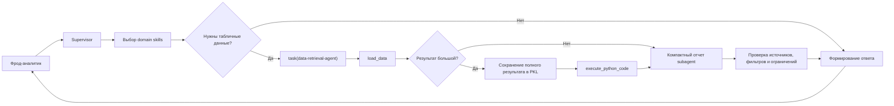

# Отчет о решении «Аналитический DeepAgent»

## Отчет о разработке

| Поле | Значение |
|---|---|
| Наименование подразделения / трайба | Департамент противодействия мошенничеству / [ЗАПОЛНИТЬ] |
| Название инициативы | Аналитический DeepAgent / Co-pilot фрод-аналитика |
| ID версии модели в БМ | [ЗАПОЛНИТЬ ПОСЛЕ ВЫБОРА МОДЕЛИ] |
| Контакты заказчика | [ЗАПОЛНИТЬ] |
| Контакты команды разработки | [ЗАПОЛНИТЬ] |

Дата подготовки: 9 июня 2026 года.

## Содержание

1. Глоссарий
2. Описание задачи
3. Описание данных
4. Настройка и обучение модели(ей)
5. Эксплуатация модели(ей) в решении
6. Результаты оценки решения
7. Тестирование решения на статус SOTA
8. Приложение

## 1. Глоссарий

| Термин | Определение |
|---|---|
| ДПМ | Департамент противодействия мошенничеству. |
| Supervisor | Основной агент, который понимает бизнес-запрос, планирует анализ, делегирует чтение данных и формирует итоговый ответ. |
| Data-retrieval-agent | Специализированный subagent для чтения и первичной обработки табличных данных. |
| Domain skill | Версионируемая инструкция с описанием источника данных, полей, связей и алгоритма выполнения аналитической задачи. |

## 2. Описание задачи

### Бриф

| Вопрос | Ответ                                                                                                                                                                                         |
|---|-----------------------------------------------------------------------------------------------------------------------------------------------------------------------------------------------|
| Краткое описание бизнес-задачи | "Deeapagent аналитика" для анализа банковских данных, расчета аналитических показателей, поиска информации по сработкам и связанным событиям, а также снижения порога входа новых сотрудников. |
| Цель применения LLM | Интерпретация запроса пользователя, выбор доменного контекста, построение плана анализа, оркестрация специализированного subagent и инструментов, формирование проверяемого ответа.           |
| Бизнес-метрики для ответов LLM | Прямое влияние на бизнес-метрики отсутствует. .                                                                                                                                               |
| Значения бизнес-метрик, которые требуется достичь | Прямое влияние на бизнес-метрики отсутствует                                                                                                                                                  |
| Предполагаемый срок релиза | Q4 2026                                                                                                                                                                                       |
| Контур, в котором будет эксплуатироваться решение | Alpha                                                                                                                                                                                         |
| Уровень доступа к данным | K-3                                                                                                                                                                                           |
| Предполагаются ли ответы LLM в realtime или несколько генераций? | Интерактивный режим диалога. Операции чтения и обработки больших данных могут выполняться дольше обычного текстового ответа.                                                                  |
| Знакомы ли вы с процессом разработки решений с использованием LLM? | Да.                                                                                                                                                                                           |
| Как планируется проводить разметку примеров? | Эталонные ответы и ожидаемые действия формируются разработчиками и специалистами вручную самостоятельно                                                                                       |
| Как планируется проводить оценку ответов LLM? | Автоматическая проверка итогового ответа и обязательных вызовов инструментов                                                                                                                  |
| Проводились ли самостоятельные эксперименты с LLM? | Да                                                                                                                                                                                            |
| Какие LLM и параметры были протестированы? | Модель: GigaChat-2-Max Параметры: temp=0.2 profanaty_check=False - Остальные дефолтные; Модель: GigaChat-3-Ultra Параметры: temp=0.2 profanaty_check=False - Остальные дефолтные              |
| Какая модель показала лучший результат? | GigaChat-2-Max                                                                                                                                                                                |
| Какой prompt дал лучший результат? | Файл с промптом передан на валидацию в составе пакета файлов агента и тестовой корзиной                                                                                                       |
| На каком количестве примеров тестировали LLM? | Текущая автоматическая тестовая корзина содержит 30 end-to-end сценариев.                               |

### Бизнес-процесс

#### Общее описание бизнес-процесса и потребности

В рамках основной функции фрод-аналитики сотрудники ДПМ:

- исследуют сработки антифрод-мониторинга и связанные банковские события;
- рассчитывают количественные показатели и аналитические метрики;
- сопоставляют данные из нескольких событийных источников;
- проверяют гипотезы и готовят выводы для последующего принятия решений человеком.

Для выполнения таких задач аналитику требуется знать назначение таблиц, состав и
смысл полей, ключи связи, правила фильтрации и особенности расчета показателей.
Существенная часть времени затрачивается не на интерпретацию результата, а на
поиск источника и подготовку выборки.

«Аналитический DeepAgent» предназначен для выполнения этих операций по запросу
на естественном языке.

#### Задачи агента

1. Определение аналитического намерения пользователя.
2. Выбор минимально необходимого доменного контекста.
3. Оркестрация специализированного subagent и доступных инструментов.
4. Анализ данных и расчет аналитических показателей.
5. Поиск сработок, клиентов и событий по идентификаторам, правилам и описаниям.
6. Исследование поведения клиента в день сработки или за заданный период.
7. Подготовка проверяемых ответов и отчетов.
8. Снижение порога входа в работу новых сотрудников.

#### Кто является пользователями решения

- антифрод-аналитики;
- исследователи данных 
- инженеры

#### Какие алгоритмы или модели применяются в процессе сейчас

Анализ выполняется сотрудниками с использованием запросов к данным, Python,
Spark и Jupyter-ноутбуков. Специализированный агент, который объединяет доменные
инструкции, чтение таблиц и расчеты по запросу на естественном языке, внедряется
как дополнительный инструмент.

#### Как LLM интегрируется в процесс

Пользователь передает аналитический вопрос в диалоговом интерфейсе. Supervisor
определяет требуемые действия, выбирает domain skills, при необходимости
делегирует чтение таблиц `data-retrieval-agent`, проверяет результат и формирует
ответ. Целевой способ размещения и контур интеграции: [ЗАПОЛНИТЬ].

#### Механизм влияния решения на бизнес-процесс

- сокращение времени поиска таблиц, полей и правил связи;
- сокращение времени выполнения типовых аналитических запросов;
- снижение зависимости результата от неформальных знаний отдельных сотрудников;
- унификация повторяемых алгоритмов анализа через domain skills;
- уменьшение риска технических ошибок при выборе источника, периода и поля расчета;
- ускорение адаптации новых сотрудников;
- повышение воспроизводимости аналитических расчетов;
- сохранение времени аналитика для проверки гипотез и интерпретации результата.

#### Использование результата человеком или другим алгоритмом

Результат используется фрод-аналитиком для дальнейшего исследования, проверки
гипотез и подготовки решений. Агент не принимает автономных решений по клиенту
или операции и не изменяет правила промышленного фрод-мониторинга.

#### Ожидаемый финансовый эффект

Прямой финансовый эффект не рассчитан. Ожидаемый эффект связан с повышением
операционной эффективности аналитиков.

#### Проверялись ли более простые альтернативы

Часть типовых расчетов может быть реализована детерминированными скриптами.
Использование LLM обусловлено вариативностью пользовательских формулировок,
необходимостью выбирать источники и последовательность действий для разных
аналитических вопросов. 

### Метрики

#### Ключевые и вспомогательные бизнес-метрики

Прямые бизнес-метрики пока не определены. 

#### Ключевые и вспомогательные ML-метрики

- правильность финального ответа;
- правильность выбора и параметров вызова tools;

#### Порог принятия решения в промышленную эксплуатацию

Точность > 0.8

#### Текущие показатели

По результатам проверки на GigaChat-2-Max точность составила 20%

#### Формулы и логика расчета нестандартных метрик

Автоматическая корзина отдельно проверяет наличие ожидаемых фрагментов в
финальном ответе, обязательных вызовов tools и соответствие их аргументов
заданным регулярным выражениям. Методика итоговой агрегации и учета частично
правильных ответов будет зафиксирована до полного прогона.

### Дизайн пилота (опционально)

Этап пилота отсутствует

## 3. Описание данных

### Процесс порождения данных

#### Описание источников входных данных для LLM

Первичным входом является пользовательский запрос на естественном языке.
В запросе могут быть указаны:

- аналитическая задача;
- период;
- идентификатор клиента или события;
- название или описание правила;
- требуемый показатель;
- группировка, детализация или формат результата.

LLM интерпретирует запрос, выбирает domain skills и организует вызов
инструментов. Банковские факты поступают не из знаний LLM, а из подключенных
табличных источников.

Текущая архитектура поддерживает три логических источника:

| Источник | Назначение | Зерно |
|---|---|---|
| `hits` | Сработки антифрод-мониторинга, правила, решения, признаки жалоб, save/fp и маршрут к raw-событиям. | Одна строка — одна сработка. |
| `cards` | Исходная история карточного канала: POS, e-commerce, ATM, merchant, MCC и карточные признаки. | Одна строка — одно событие карточного канала. |
| `uko` | Исходная история ДБО, СБП и переводов: счета, получатели, устройства, IP и географические признаки. | Одна строка — одно событие не карточного канала. |

Основные ключи и связи:

- `event_id` используется для точной связи сработки с raw-событием, когда
  идентификатор совпадает в источниках.
- `epk_id` используется как клиентский ключ и fallback для связи событий.
- `event_dt` используется для ограничения периода и связи событий по клиентскому
  дню.

#### Описание процесса порождения верных ответов (ground truth) и обратной связи

Для каждого тестового сценария фиксируются:

- пользовательский запрос;
- эталонный результат;
- обязательные действия агента;
- ожидаемые источники;
- ограничения к финальному ответу;
- ожидаемые вызовы tools и требования к их аргументам.

#### Может ли меняться количество источников и как часто

Архитектура допускает подключение новых таблиц и скилов.
Добавление источника требует создания или обновления domain skills с описанием
полей, ключей и ограничений. Плановая частота изменения состава
production-источников: по требованию.

### Контрольные датасеты (тестовый датасет, тестовая корзина)

#### Описание тестовых наборов данных

В локальном стенде используются синтетические данные для 
проверки:

| Набор | Объем |
|---|---:|
| Сработки `hits` | 87 строк |
| Карточные события `cards` | 500 строк |
| События `uko` | 500 строк |

Автоматическая end-to-end корзина содержит 30 сценариев. Сценарии охватывают
поиск сработок и клиентов, расчет статистик и долей, semantic search по
`event_description`, разбор JSON-полей, переход из `hits` в raw-источники,
группировки, top-N и сравнение периодов.

Период синтетических данных и уровень конфиденциальности:

- данные являются тестовыми и не должны интерпретироваться как реальные
  показатели банковского процесса;
- точный период каждого сценария зафиксирован в тестовой корзине;
- класс конфиденциальности production-данных: [ЗАПОЛНИТЬ].

Расшифровка полей хранится в `fields.md`, а правила связи — в `joins.md`.

#### Поделены ли запросы на категории

Да. Категории сценариев включают:

- простые ответы без чтения данных;
- выборку из одной таблицы;
- агрегации и расчеты;
- обработку больших результатов через `.pkl`;
- semantic search;
- поиск по точному `event_id`;
- связь нескольких источников;

#### Как формировались вопросы и ответы

Вопросы сформированы на основании типовых задач фрод-аналитика и возможностей
синтетических источников. Эталонные ответы рассчитаны по тестовым таблицам.
Ожидаемый путь выполнения дополнительно зафиксирован через обязательные и
запрещенные действия.

#### Подразделение, осуществлявшее подготовку данных

Департамент противодействия мошенничеству / Управление развития и моделирования Ai

### Тренировочные датасеты (если было дообучение)

Дообучение не проводилось. Тренировочные датасеты не использовались.

### Разметка данных / оценка ответов

#### Инструкция для формирования True answer

При подготовке эталона необходимо:

1. Определить ожидаемый источник на основании domain skills.
2. Зафиксировать период и подтвержденные фильтры.

#### Инструкция для оценки ответов LLM

Ответ проверяется по следующим признакам:

- соответствует ли финальный результат эталону;
- использованы ли обязательные tools;

Техническая автооценка реализована в `deep_agent_test/run_test_basket.py`.

#### Разрешение конфликтов при разметке

[ЗАПОЛНИТЬ. Рекомендуемый вариант: спорный пример пересматривается предметным
экспертом; при отсутствии однозначного эталона кейс исключается или помечается
как допускающий несколько ответов.]

#### Агрегация оценок асессоров

Не применимо

#### Количество экспертов при разметке одного примера

Не применимо

#### Количество асессоров при оценке одного примера

Не применимо

#### Обоснование квалификации экспертов и асессоров

Не применимо

## 4. Настройка и обучение модели(ей)

### Подбор prompts и параметров генерации

#### История экспериментов и проверенных гипотез

В ходе разработки зафиксированы следующие архитектурные гипотезы и решения:

- выделение специализированного `data-retrieval-agent`;
- сохранение основного бизнес-рассуждения и итогового ответа за supervisor;
- запрет прямого чтения таблиц supervisor;
- минимальная предзагрузка релевантных domain skills;
- вынесение полного описания полей из основного prompt;
- сохранение больших результатов в отдельный `.pkl`-артефакт;
- выполнение расчетов по полному артефакту, а не по preview;
- ограничение доступных инструментов отдельно для каждой роли;
- защита от повторяющихся вызовов инструментов;

Поведение решения задается четырьмя уровнями:

1. Системный prompt supervisor.
2. Системный prompt `data-retrieval-agent`.
3. Domain skills с описанием таблиц и workflow.
4. Контракты инструментов и middleware-ограничения.

Разделение ответственности:

**Supervisor:**

- понимает бизнес-вопрос;
- выбирает skills;
- решает, требуется ли чтение данных;
- формирует ограниченную задачу для subagent;
- выполняет дополнительный расчет по сохраненному артефакту при необходимости;
- проверяет доказательства;
- формирует итоговый ответ.

**Data-retrieval-agent:**

- читает таблицы через `load_data`;
- выбирает поля и фильтры на основании skills;
- читает вспомогательные `fields.md` и `joins.md`;
- выполняет небольшие преобразования;
- возвращает supervisor компактный отчет с источниками, фильтрами, результатами и
  ограничениями.

Основное бизнес-рассуждение и итоговая ответственность не передаются subagent.

Текущий набор domain skills включает:

- карточку таблицы сработок;
- карточку карточных raw-событий;
- карточку raw-событий ДБО/СБП;
- workflow расчета статистики по правилу;
- workflow поиска записей по смысловому описанию;
- справочные описания полей и связей.

Такой подход отделяет механику агента от бизнес-смысла данных. Для подключения
нового проекта или источника обновляется доменный слой, а не базовый код
оркестрации.

Сравнение конкретных LLM и параметров генерации будет добавлено после фиксации
целевой модели и выполнения полного прогона.

#### Результаты подсчета ML-метрик по каждому эксперименту

Не включаются до завершения единого сравнительного прогона. Для каждого
эксперимента необходимо зафиксировать модель, параметры генерации, версию prompts
и skills, состав тестовой выборки и рассчитанные показатели.

#### Логика выбора one-shot / few-shot примеров

В текущей реализации основным источником доменного поведения являются system
prompts и domain skills. Отдельные few-shot примеры в итоговом отчете должны
описываться только при их фактическом использовании в выбранной конфигурации.
Логика выбора примеров: [ЗАПОЛНИТЬ ПОСЛЕ ФИКСАЦИИ ЦЕЛЕВОГО PROMPT].

### Дообучение (включая RAG)

Дообучение модели не проводилось.

Векторная RAG-база не используется. Доменный контекст подключается через
версионируемые `SKILL.md`, `fields.md` и `joins.md`. Middleware загружает
минимально необходимый набор skills, а подробные файлы читаются только при
необходимости.

## 5. Эксплуатация модели(ей) в решении

### Блок-схема пайплайна для инференса



#### Инструменты supervisor

| Инструмент | Назначение |
|---|---|
| `write_todos` | Краткий план многошаговой задачи. |
| `task` | Делегирование одного связного objective специализированному subagent. |
| `execute_python_code` | Расчеты по сохраненным данным и подготовка итоговых таблиц. |
| `load_skills` | Дозагрузка недостающих `SKILL.md`. |

Supervisor не имеет прямого доступа к `load_data` и filesystem-инструментам.

#### Инструменты data-retrieval-agent

| Инструмент | Назначение |
|---|---|
| `load_data` | Чтение таблиц с подтвержденными полями и фильтрами. |
| `execute_python_code` | Обработка полного сохраненного результата. |
| `ls`, `read_file`, `glob`, `grep` | Чтение доменной документации и артефактов. |

#### Контроль надежности

В архитектуре предусмотрены:

- allowlist инструментов отдельно для supervisor и subagent;
- отключение generic `execute`;
- отключение универсального general-purpose subagent;
- ограничение количества model calls внутри subagent;
- блокировка технического цикла одинаковых tool calls;
- очистка старых tool results при росте контекста;
- offload больших результатов в `.pkl`;
- Python sandbox с запретом `eval`, `exec`, shell-вызовов и удаления файлов;
- проверка успешности tool call до использования результата;
- trace-логирование запросов и инструментальных шагов.

#### Режимы подключения данных

Локальный режим использует совместимый `load_data` поверх CSV и pandas.

Целевой режим предусматривает:

- `load_data` поверх Spark session; либо
- подключение собственной фабрики инструментов чтения данных.

Оба режима используют единый контракт запроса и одинаковую архитектуру агента.

#### Ключевые пользовательские сценарии

- подсчет сработок по правилу;
- расчет числа уникальных клиентов;
- расчет суммы, среднего, минимума и максимума;
- расчет долей по признакам;
- поиск событий клиента за день сработки;
- анализ типов и подтипов операций;
- поиск смысловой категории операций;
- построение top-N по торговым предприятиям или банкам получателя;
- анализ связи правил с типами операций и категориями;
- сравнение активности между периодами;
- анализ клиентской активности по продуктам и поверхностям.

#### Результат сценария

Итоговый ответ должен содержать:

- прямой ответ на бизнес-вопрос;
- использованный источник;
- период и ключевые фильтры;
- основные факты или расчет;
- ограничения и неоднозначности;
- путь к артефакту только тогда, когда он требуется для проверки или продолжения
  анализа.

### Описание алгоритмов предобработки и постобработки данных

Предобработка включает:

- интерпретацию пользовательского запроса;
- выбор domain skills;
- определение источника, периода и требуемых полей;
- формирование структурированного запроса для `load_data`;
- приведение длинных идентификаторов и дат к форматам, ожидаемым источником.

Постобработка включает:

- расчет показателей через возможности `load_data` или `execute_python_code`;
- обработку полного `.pkl`-артефакта при offload больших результатов;
- проверку источников, фильтров и ограничений;
- формирование краткого ответа на русском языке.

### Код

#### Ссылка на репозиторий с кодом end-to-end пайплайна

[ЗАПОЛНИТЬ ССЫЛКУ НА ЦЕЛЕВОЙ РЕПОЗИТОРИЙ]

Основной пакет в текущем рабочем проекте: `deep_agent_test/`.

#### Инструкция по запуску пайплайна

Локальный запуск одного сценария:

```bash
python run.py
```

Запуск автоматической тестовой корзины:

```bash
python deep_agent_test/run_test_basket.py
```

#### Названия и версии используемых моделей

[ЗАПОЛНИТЬ ПОСЛЕ ВЫБОРА ЦЕЛЕВОЙ МОДЕЛИ]

#### Выбранные параметры генерации

[ЗАПОЛНИТЬ: temperature, top-p, top-k, repetition penalty, ограничения токенов,
таймауты и retries.]

#### Текст системного prompt

Актуальные системные prompts находятся в `deep_agent_test/core/prompts.py`:

- `SYSTEM_PROMPT`;
- `DATA_RETRIEVAL_PROMPT`;
- prompt-блоки контрактов инструментов;
- шаблоны контекста preloaded skills.

#### Текст шаблона запроса

Пользовательский запрос не стандартизирован и передается на естественном языке.
Стандартизированы системные prompts, контракт делегирования и SQL-подобный
формат аргумента `query` инструмента `load_data`.

## 6. Результаты оценки решения

### Результаты подсчета ML-метрик на контрольном датасете

Будут заполнены после полного прогона единой моделью и конфигурацией.

Планируемый формат:

| Эксперимент / категория | Количество наблюдений | Правильность tools | Правильность ответа | Ограничения |
|---|---:|---:|---:|---|
| Полная тестовая корзина | [ЗАПОЛНИТЬ] | [ЗАПОЛНИТЬ] | [ЗАПОЛНИТЬ] | [ЗАПОЛНИТЬ] |

Перед прогоном фиксируются версия кода, модель, параметры генерации, prompts,
skills и состав контрольной выборки.

### Результаты оценки ответов модели асессорами

[ЗАПОЛНИТЬ ПОСЛЕ РУЧНОЙ ОЦЕНКИ ИЛИ УКАЗАТЬ «НЕ ПРИМЕНИМО».]

### Среднее время инференса для одного примера

[ЗАПОЛНИТЬ ПО РЕЗУЛЬТАТАМ ПОЛНОГО ПРОГОНА. РЕКОМЕНДУЕТСЯ УКАЗАТЬ СРЕДНЕЕ,
МЕДИАНУ, P95 И ДИАПАЗОН.]

### Потребление оперативной памяти во время инференса

[ЗАПОЛНИТЬ. ЕСЛИ ИСПОЛЬЗУЕТСЯ ЦЕНТРАЛИЗОВАННЫЙ ИНФЕРЕНС И ИЗМЕРЕНИЕ
НЕДОСТУПНО, УКАЗАТЬ ЭТО ЯВНО.]

### Ссылка на репозиторий со скриптами для подсчета метрик

[ЗАПОЛНИТЬ ССЫЛКУ]

Текущий локальный скрипт: `deep_agent_test/run_test_basket.py`.  
Структурированный результат: `runs/test_basket_report.json`.

## 7. Тестирование на статус SOTA

Не применимо на текущем этапе.

## 8. Приложение

### Основные артефакты проекта

- `deep_agent_test/README.md` — описание возможностей и запуска;
- `deep_agent_test/core/analytics_deep_agent.py` — сборка архитектуры;
- `deep_agent_test/core/prompts.py` — контракты supervisor и subagent;
- `deep_agent_test/resources/skills/` — доменный слой;
- `deep_agent_test/test_basket.json` — автоматическая тестовая корзина;
- `deep_agent_test/TEST_CASES.md` — человекочитаемое описание тестов;
- `tests/` — unit-тесты инструментов и middleware;
- `runs/deep_agent_traces/` — трассы запусков;
- `runs/test_basket_report.json` — структурированный отчет тестовой корзины.

### Ссылки

- Репозиторий: [ЗАПОЛНИТЬ].
- Задача/инициатива: [ЗАПОЛНИТЬ].
- Документация по доступу к модели: [ЗАПОЛНИТЬ].
- Путь к пакету для валидации: [ЗАПОЛНИТЬ].

### Действия перед передачей пакета на валидацию

1. Удалить секреты из исходного кода и отозвать ранее опубликованные ключи.
2. Зафиксировать целевую модель и параметры генерации.
3. Выполнить полный прогон контрольной корзины.
4. Добавить результаты, длительность, ограничения и анализ ошибок.
5. Заполнить организационные параметры и описание production-данных.
